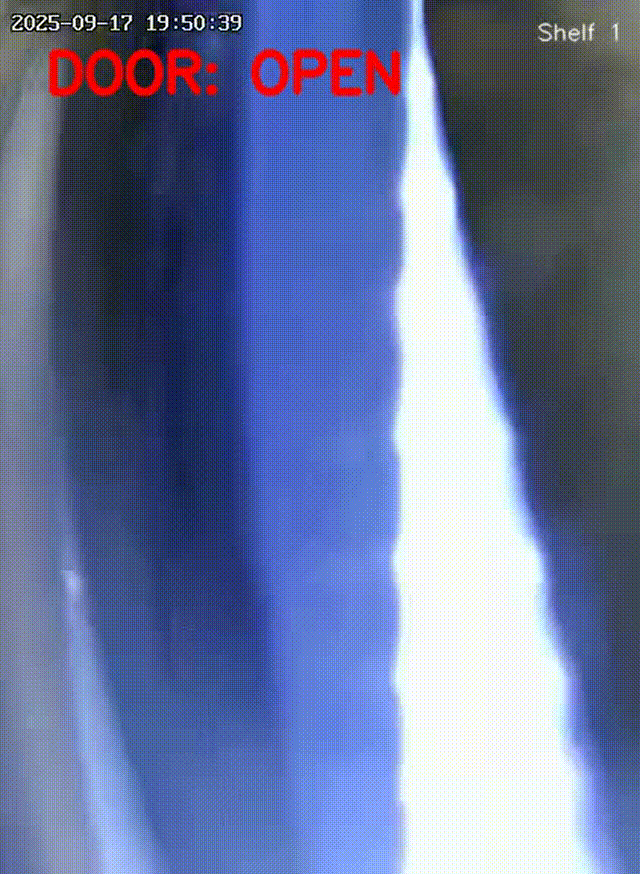

# 🥤 Vending Machine Vision Pipeline

This project implements a **computer vision pipeline** for analyzing transactions inside a vending machine.  
It processes video footage to detect key objects (hands, boxes, products) and track when the machine door is open or closed.  
The pipeline also supports **event-driven video recording** and structured logging for debugging and analysis.  

---

## 📂 Project Structure

```
.
├── main.py                  # Entry point: runs pipeline
├── detector.py              # YOLO detector wrapper + annotation
├── door_state.py            # Door state tracker (brightness threshold)
├── recordings/              # Saved annotated clips
│   └── <video_name>/        # One folder per input video
├── logs/
│   └── pipeline.log         # Console + file logs for each run
├── tests/
│   ├── test_detector.py     # Unit tests for detector
│   └── test_door_state.py   # Unit tests for door state tracker
├── requirements.txt         # Python dependencies
└── README.md                # Project documentation
```

---

## ⚡ Features

- **Object detection (YOLOv8)**  
  Detects `hand` and `box`class-specific colors.  

- **Door state tracking**  
  Determines whether the vending machine door is open or closed using image brightness.  

- **Overlay & annotation**  
  Draws bounding boxes, confidence scores, and a clear `"DOOR: OPEN / CLOSED"` label on each frame.  

- **Event-driven recording**  
  Records video clips **only while the door is open**, and saves them under `recordings/<video_name>/`.  

- **Structured logging**  
  Logs detections, door state, and frame IDs to both console and `logs/pipeline.log`.  

- **Unit tested**  
  Includes pytest tests for both detection and door state logic.  

---

## 🛠️ Setup

### Requirements
- Python **3.12** (per interview requirements)
- `venv` or `conda` recommended

### Installation
```bash
# clone the repo
git clone <your_repo_url>
cd <repo_name>

# create venv
python3.12 -m venv .venv
source .venv/bin/activate

# install dependencies
pip install -r requirements.txt
```

### Example `requirements.txt`
```text
ultralytics==8.3.5
opencv-python
numpy
pydantic
pytest
```

---

## ▶️ Usage

### Run pipeline
```bash
python main.py
```

By default it processes `994a237a-3d0c-4792-8407-096ed45a0fd3.mp4` and saves annotated door-open clips in:

```
recordings/994a237a-3d0c-4792-8407-096ed45a0fd3/
```

### Live view
A window will show annotated detections:
- Red text → **DOOR: OPEN**
- Green text → **DOOR: CLOSED**
- Bounding boxes for hands (red), boxes (blue), products (yellow)

Press `q` to quit early.

---

## 📜 Logging

Each run produces logs like:

```
2025-10-02 15:41:22 [INFO] vending-pipeline: 
{'frame_id': 128, 'door_open': True, 'detections': [
   {'label': 'box', 'confidence': 0.61, 'bbox': (237, 391, 312, 550)}
]}
```

- Logs stream to **console** and are also written to `logs/pipeline.log`.  
- Each recording event is logged:
  ```
  Started recording: recordings/<video_name>/door_open_clip_000.mp4
  Stopped recording
  ```

---

## ✅ Testing

Run unit tests:

```bash
pytest -v
```

### Example tests
- **Detector**: verifies bounding box annotation works with fake detections.  
- **Door state**: verifies bright frames are “open” and dark frames are “closed”.  
- **Integration**: ensures annotated frames can be saved as images.  

---

## 🧩 Design Choices

- **Separate `DoorStateTracker`**  
  Clear separation of concerns: YOLO handles detection, tracker handles door logic.  
  Makes testing easier and allows future extension (segmentation, sensor input).  


- **Event-driven recording**  
  Efficient storage: only save clips when events matter (door open).  

- **Structured logs**  
  Logs are JSON-like for easy parsing / ingestion into monitoring tools.  

---


## 🎬 Quick Demo GIF


Embed gif:

```markdown

```

---

## 👥 Credits

Developed as part of a **technical interview task for Boost Inc.**, showcasing Python 3.12, YOLOv8, and event-driven CV pipelines.  
